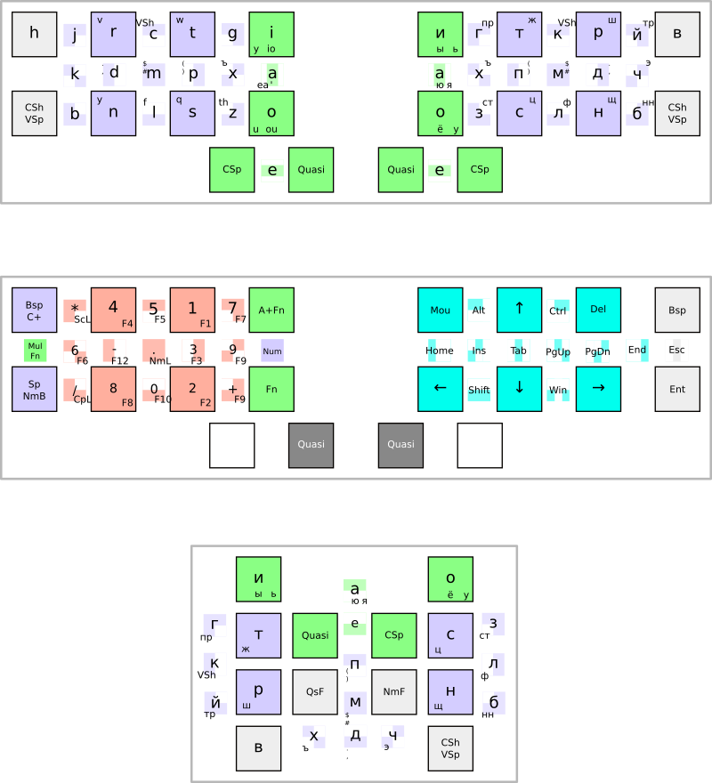
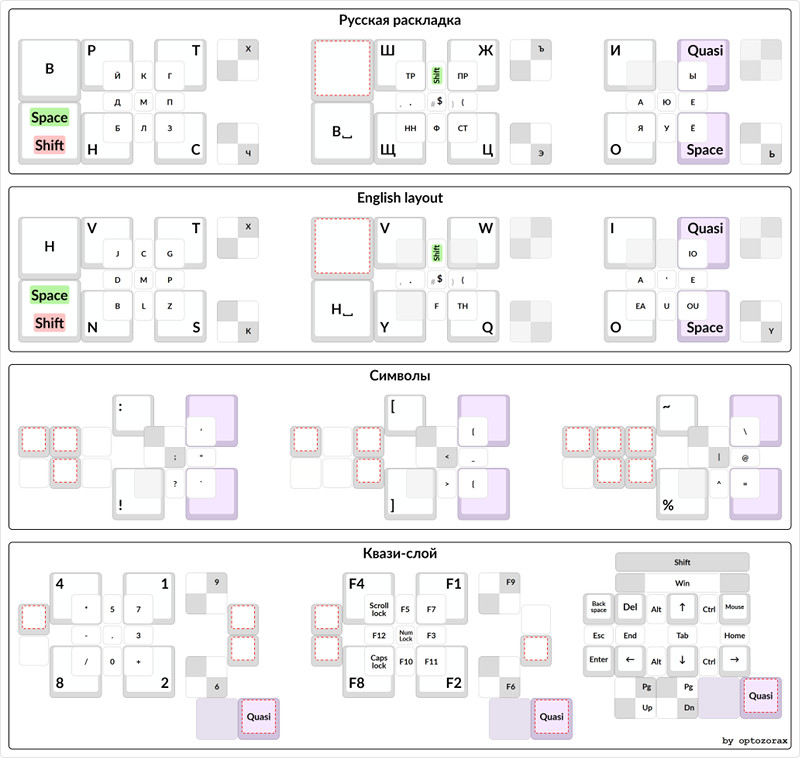
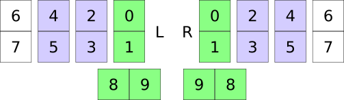
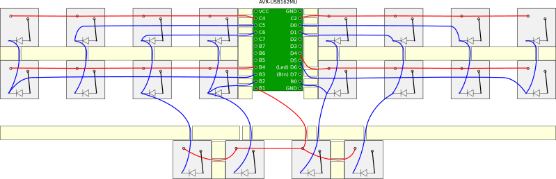
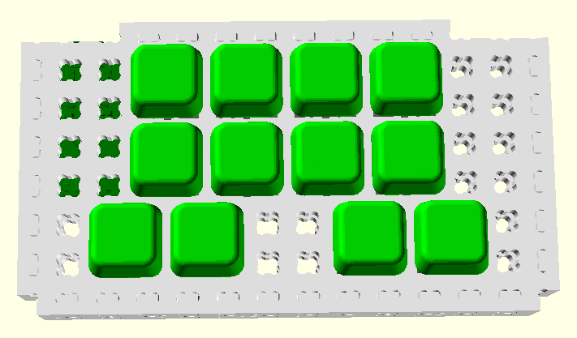
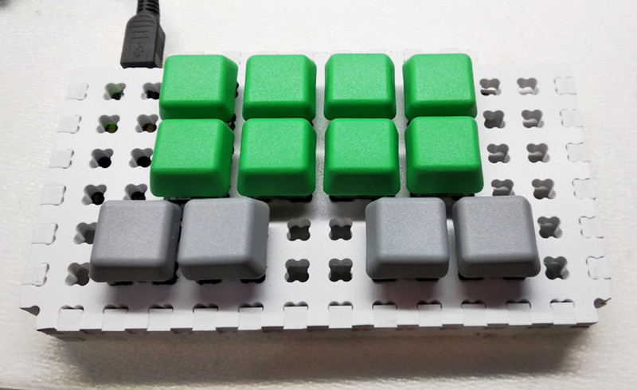

# Аккордовая клавиатура Кладенец

Кладенец-23 это аккордовая клавиатура для печати до 4 букв за один аккорд двумя руками. Теоретически позволит ускорить печать в 2 раза, по сравнению со стандартными клавиатурами.

Позволяет полноценно работать одной рукой, хоть левой, хоть правой. Может управлять курсором мыши как текстовым курсором, а так же использовать вертикальную прокрутку.

Принцип печати похож на стенотайп, но не нужно изучать аккорды для нескольких тысяч слов, достаточно будет изучить лишь аккорды для букв, скорость печати при этом прогнозируется сравнимой со скоростью печати на стенотайпе.

В описании клавиатуры используются термины `тамб` (большой палец) и `фингеры` (остальные пальцы).

## Принцип работы

Для гласных букв выделены кнопки на большом и указательном пальцах, одна из кнопок на большом пальце по совместительству является кнопкой для квази-режимов (Quasi), размещено 10 гласных букв (исключение в виде мягкого знака Ь, который поменялся местами с редкой Э, последняя в блоке согласных букв).

Согласные буквы набираются на пяти кнопках средним и безымянным пальцем, и мизинцем, нижняя кнопка на мизинце является умным пробелом, за счёт чего можно любой аккорд завершить пробелом, всего в этом блоке доступен 31 аккорд.

Внешняя кнопка на тамбе является кнопкой Quasi, что даёт на фингерах (8 кнопок) до 255 аккордов. Quasi позволяет удерживать нажатыми модификаторы (Shift, Ctrl, Alt, Win), а также кнопки мыши, до тех пор, пока нажата кнопка Quasi.

В слое Quasi размещены также все буквы, аккорды букв примерно похожи на те, что в основном слое, нужно это для клавиатурных сочетаний с модификаторами.

## Раскладка клавиатуры

[SVG](layout/layout.svg)

## Аккорды

Нумерация кнопок и бит у аккордов:

### Навигация для левой руки:

Left `9-5`, Right `9-1`, Home `9-45`, End `9-01`

### Навигация для правой руки:

Left `9-1`, Right `9-5`, Home `9-01`, End `9-45`

### Навигация для любой руки:

Up `9-2`, Down `9-3`, PageUp `9-25`, PageDown `9-34`

### Присутствуют все модификаторы, левые на нижнем ряду, правые на верхнем ряду:

LCtrl `9-13`, LAlt `9-35`, LWin `9-15`, LShift `9-135`

RCtrl `9-02`, RAlt `9-24`, RWin `9-04`, RShift `9-024`

### Есть совмещённые модификаторы:

Alt+Tab `9-235`, Ctrl+Tab `9-234`, Ctrl+PgUp `9-123`, Ctrl+PgDn `9-023`

Ctrl+Ins `9-134`, Shift+Ins `9-1345`, Shift+Del `9-0245`

Ctrl+Left `9-124`, Ctrl+Right `9-025`

### Умножитель нажатия кнопок

Если на одной половине нажать цифровую часть аккорда слоя цифр `2-5`, а на другой аккорд слоя навигации или аккорда Mod-, то эта кнопка будет нажата несколько раз, либо с зажатым модификатором:

1 - Ctrl+

2-10 - от 2 до 10 раз

11 - 15 раз

12 - 20 раз

13 - 30 раз

14 - Win+

15 - Alt+

Есть и квазиумножитель, это аккорд `9-671-[2-5]`, действует пока удерживается кнопка Quasi `9`, сброс квазиумножителя это аккорд `9-01234567`.

### Различные виды Backspace:

Backspace `9-6`, Ctrl+Backspace `9-026`

### Гласные:

Для ввода гласных используются кнопки `[0189]`.

Гласные разбиты на 3 группы по 3 аккорда на указательном пальце, первая группа нажимается без использования большого пальца, вторая при зажатой `8`, третья при зажатых `89`: `иоа`, `ьуя`, `ыёю`.

Сочетания с Ctrl или другими модификаторам набираются как `9-1-[67]` для букв `ioa`, `9-0-[67]` для `heu`, очерёдность букв такая: `6`, `7`, `67`.

Одиночный аккорд `VShift` без гласной буквы является кнопкой Tab.

### Согласные:

Для ввода согласных букв используются кнопки: `[2-6]`. В области согласных букв так же присутствует аккорд шифта для гласных и выделено три группы аккордов для символов.

При зажатой Quasi `9`, и `7` для букв без аккорда `6`, согласные нажимаются с Ctrl, если не нажаты другие модификаторы, исключение для буквы `h`, смотри в гласных.

### Символы:

`.,:;'!?``"` `456`

`$#~|\%^=@` `23456`

`()[<{]>}_` `236`

Сочетания с модификаторами:

Ctrl+. `9-456`, Ctrl+, `9-1456`, Ctrl+; `9-0456`

Ctrl+[ `9-236`, Ctrl+] `9-0236`

Ctrl+' `9-23456`, Ctrl+`` `9-023456`

При удерживании на другой половине клавиатуры базовых аккордов (`456`, `236`, `23456`) с шифтом `7`, на другой половине можно нажимать часть аккорда из слоя гласных букв `0189`

### Цифры:

Порядок аккордов (просто складываем 1248): 1-90-+/*. В русской расладке вместо точки запятая.

**С цифрового ряда**: `9-01-[2-5]`, `7` добавляет пробел, `6` зажимает Ctrl, если не зажаты другие модификаторы, при этом точка и в русской раскладке является точкой, а вместо * обратный слеш \

**С цифрового блока**: `9-01-[2-5]-67`

При удерживании на другой половине клавиатуры аккорда цифр `901`, и возможно `6` или `7`, а на другой половине клавитуры самих цифр `2345`, и возможно `6` или `7`, эти аккорды будут работать как единый на одной половине клавиатуры. Это позволит разгрузить руку, которая вводит цифры.

### Функциональные кнопки:

`9167+[2-5]` порядок аккордов (просто складываем 1248): F1-F12, Scroll Lock, Caps Lock, Num Lock.

`9067+[2-5]` с зажатым Alt.

Print Screen = Alt+NumLock `90-234567`

Pause/Break = Alt+CapsLock `90-34567`

При удерживании на одной половине клавиатуры аккорда функциональных кнопок `9167` или `9067`, а на другой половине клавитуры аккорда номера функциональной кнопки `2345`, и возможно `0` или `1`, эти аккорды будут работать как единый на одной половине клавиатуры.

## Схема

## Прошивка

Код клавиатуры написан на языке си, используется библиотека [LUFA](http://www.fourwalledcubicle.com/LUFA.php)

Файлы сканирования клавиатуры, с учётом разных схем клавиатуры, расположены в `*.h` файлах. Основной код Кладенца находится в файле `kl23.c`

Для заливки в свой контроллер необходимо правильно описать его в файле `makefile`, создать для своей клавиатуры файл на основе `promicro.h`, и подключить его в `kl23.c`, компиляция происходит командой:

	$ make

Заливка в контроллер зависит от установленного загрузчика одной из двух команд:

	$ make dfu

	$ make avrdude

[Firmware](firmware/)

## Структор

Из-за того, что шаг у Структора 10 мм, возможно создать клавиатуру с увеличенным на 1 мм расстоянием между кнопок, и делать смещения кнопок с шагом 1/2, а не 1/4.

[SCAD](spline/kladenets-structor.scad)

## Концепт клавиатуры Кладенец-2 (3,1,М)

Этот концепт предшествовал Кладенцу-23, но выявились недостатки в виде необходимости иметь кнопку Quasi для букв, поэтому отправлен в [архив](archive/ru/). Там же краткое описание неудачного расположения кнопок у концепта Кладенец-24, самого близкого предшественника Кладенца-23.

## Лицензия

[Лицензия Apache 2.0](LICENSE.txt)

---

[Eng](https://ibnteo.github.io/kladenets/) | **Rus**
