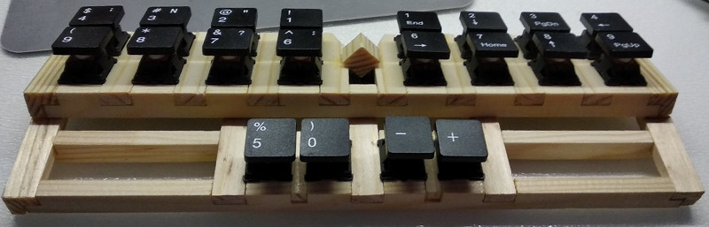
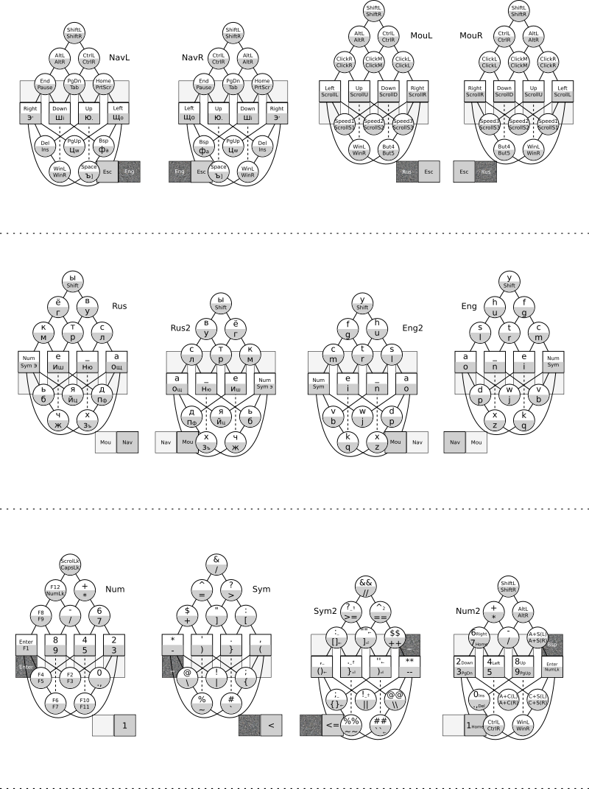

# Chord keyboard Kladenets

Kladenets-2 is a chord keyboard for printing up to 4 letters in one chord with both hands. Theoretically, it will speed up printing by 2 times compared to standard keyboards.

Allows you to fully work with one hand, even with your left, even with your right. Can control the mouse cursor as a text cursor, as well as use both vertical and horizontal scrolling.

The principle of printing is similar to a stenotype, but it is not necessary to study chords for several thousand words, it will suffice to study only chords for letters, while printing speed is predicted to be comparable to printing speed on a stenotype.

## Principle of operation

With one hand with five fingers, you can press 31 chords on five buttons, which is quite enough to accommodate all the letters and the rest of the buttons on a standard keyboard through the presence of several layers. If you make two buttons on each finger, then you can press two chords with one hand and up to 4 chords in the main layer with two hands, or 2 chords in additional layers.

The inner button on the thumb in relation to the palm is responsible for the bottom row on the remaining fingers, and the external button (farther from the palm) - for the top row.

The main layer contains 26 letters of the alphabet, a space, shift, and switches of the layers: navigation, numbers, symbols.

The letters are placed on the frequency basis, with an emphasis on reducing the load on the little fingers. Numbers and function buttons are placed on chords in binary code.

With a quadruple chord, the order of the letters goes from top to bottom, from left to right, that is, first the letter will be printed from the upper left row, then from the lower left, then from the upper right, and at the end from the lower right. If the row is not involved, it is skipped.

You can print as a single chord, or in turn, the analysis of the time you press chords allows you to reliably distinguish the style of work.

A chord is triggered as soon as a single button is released, and until a new button is pressed, releasing the following buttons will not work. This will allow a sequence of similar chords to press fewer fingers while holding certain buttons.

## Keyboard layout

For easy memorization of chords, they are written in the form of a graph, where the keyboard buttons themselves are shown as square vertices, and the round combinations of buttons, continuous ribs indicate which buttons to press for this chord, and the dotted edges indicate the buttons that DO NOT need to be pressed, for more convenient perception complex chords.

For convenience, created graphs for the left and right hands, for the upper and lower rows.

At each vertex of the graph, there are symbols that will be dialed without a thumb, and with the button pressed on the thumb.

For example, the letter A is pressed with the index finger, the letter O with the index and thumb, the letter S with the index and middle finger, and Z with all but the middle finger.

## Chords

Letters
~~~
Eng	Rus	Chord1	Chord2
A	А	1	6
B	Б	024	579
C	К	34	89
D	Д	13	68
E	Е	3	8
F	Ё	234	789
G	Г	0234	5789
H	В	123	678
I	И	03	58
J	Й	014	569
K	Ч	124	679
L	Л	012	567
M	М	034	589
N	Н	02	57
O	О	01	56
P	П	013	568
Q	Ж	0124	5679
R	Р	023	578
S	С	12	67
T	Т	23	78
U	У	0123	5678
V	Ь	24	79
W	Я	14	69
X	Х	124	679
Y	Ы	1234	6789
Z	З	0134	5689
	Щ	051
	Ю	052
	Ш	053
	Э	054
	Ф	0513
	Ц	0514
	Ъ	05134
~~~

Numbers
~~~
Num	Chord1	Chord2
1	90	45
2	91	46
3	901	456
4	92	47
5	902	457
6	912	467
7	9012	4567
8	93	48
9	903	458
0	913	468
~~~

It is very difficult to remember chords on the tables; it is better to memorize the location of the vertex in the graph.

## Kladenets-3

To print with one hand at once, 3 letters at once, it is proposed to create a keyboard with 4 rows of buttons, but slightly compacted, so that you can press the extreme buttons simultaneously on different fingers. In this case, it will be necessary to press only the buttons individually or side by side, which gives as many combinations as the total of 3 buttons, that is, 8, including the state when nothing is pressed.

~~~
000=0000
001=0001
010=0010
011=0011
100=0100
101=1000 !
110=0110
111=1100 !
~~~

## Kladenets-1

It can be executed as an auxiliary one-handed keyboard, with duplication of buttons for the thumb, so that it can be used with the left and right hand, or without it, but then with the performance under a certain hand.

## Kladenets-M

To print texts from a musical keyboard, it is proposed to make a program or a hardware adapter from a MIDI keyboard or synthesizer that switches the musical keyboard to a computer keyboard by pressing 10 keys simultaneously, after which these 10 keys will allow you to print 2 chords with two hands. The left hand will be responsible for the top row of the ordinary Kladenets (-2), the right hand for the bottom row.

## License

[License MIT](LICENSE.txt)
