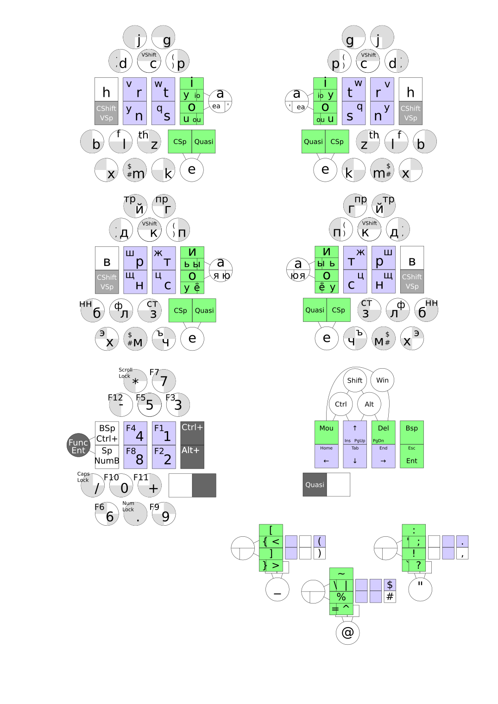
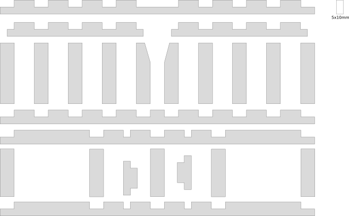
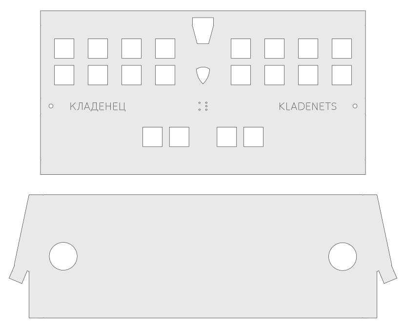

# Chord keyboard Kladenets

Kladenets-23 is a chord keyboard for typing up to 4 letters in one chord with both hands. Theoretically, you can speed up printing 2 times.

Allows you to fully work with one hand, even with your left, even with your right. It can control the mouse cursor as a text cursor, as well as use both vertical and horizontal scrolling.

The principle of printing is similar to a stenotype, but it is not necessary to study chords for several thousand words, it will suffice to study only chords for letters, while printing speed is predicted to be comparable to printing speed on a stenotype.

## Principle of operation

For the vowel letters, the buttons on the thumb and forefinger are highlighted, one of the buttons on the thumb concurrently is a button for quasi-modes (Quasi), 10 vowels are placed (the exception is in the form of a soft sign b, which has been changed from block of consonants).

The consonants are typed on the five buttons with the middle and ring finger, and the little finger, the lower button on the little finger is a clever space, due to which you can complete any chord with a space, there are 31 chords in this block.

The external button on the thumb is the Quasi button, which gives on the fingers (8 buttons) up to 255 chords. Quasi allows you to hold down the modifiers (Shift, Ctrl, Alt, Win), as well as the mouse buttons, until the Quasi button is pressed.

In the Quasi layer are also placed all the letters, the chords of the letters are roughly similar to those in the main layer, you need this for keyboard combinations with modifiers.

## Keyboard layout

[SVG](layout/layout.svg)

## Chords

...

## Schema

## The case of wooden slats 5x10 mm

[SVG](spline/spline.svg)

## 1.5 mm aluminum plate body

[SVG1](aluminium/kladenets1.svg)
[SVG2](aluminium/kladenets2.svg)

## Concept keyboards Kladenets-2 (3,1,M)

This concept was preceded by Kladenets-23, but there were shortcomings in the form of the need to have the Quasi button for letters, so it was sent to the [archive](archive/). There is also a brief description of the unsuccessful button layout of the Kladenets-24 concept, the closest predecessor of the Kladents-23.

## License

[License Apache 2.0](LICENSE.txt)

---

**Eng** | [Rus](https://ibnteo.github.io/kladenets/README-RU)
