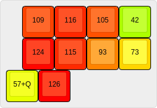

# Частотность кнопок

Частотность букв, пробел определён примерно, как почти вдвое более частый, чем О
~~~
_ = 110000
о = 55414
е = 42691
а = 40487
и = 37153
н = 33838
т = 31620
с = 27627
р = 23916
в = 22230
л = 22230
к = 17653
м = 16203
д = 15052
п = 14201
у = 13245
я = 10139
ы = 9595
ь = 8784
г = 8564
з = 8329
б = 8051
ч = 7300
й = 6106
х = 4904
ж = 4746
ш = 3678
ю = 3220
ц = 2438
щ = 1822
э = 1601
ф = 1335
ъ = 1854
ё = 1849
~~~

Нумерация кнопок:

~~~
 0246
 1357
98
~~~

~~~
0 = иаьыяю = 37153+40487+8784+9595+10139+3220=109378
1 = оауёяю = 55414+40487+13245+1849+10139+3220=124354
2 = тжпгзчмкэй = 31620+4746+14201+8564+8329+7300+16203+17653+1601+6106=116323
3 = сцпгзмхлбъф = 27627+2438+14201+8564+8329+16203+4904+22230+8051+1854+1335=115736
4 = ршгйкдбъмх = 23916+3678+8564+6106+17653+15052+8051+1854+16203+4904=105981
5 = шщйдзэлфбъмч = 3678+1822+6106+15052+8329+1601+22230+1335+8051+1854+16203+7300=93561
6 = вэфхжшцщ = 22230+1601+1335+4904+4746+3678+2438+1822=42754
7 = _ = 110000/3*2=73333
8 = еьыуёяю_ = 42691+8784+9595+13245+1849+10139+3220+110000/3=126190
9 = еыёю = 42691+9595+1849+3220=57355
~~~

## Результат

Сильные пальцы нагружены гораздо больше слабых, нагрузка распределена равномерно, на каждой из рук нагрузка будет примерно одинакова.
