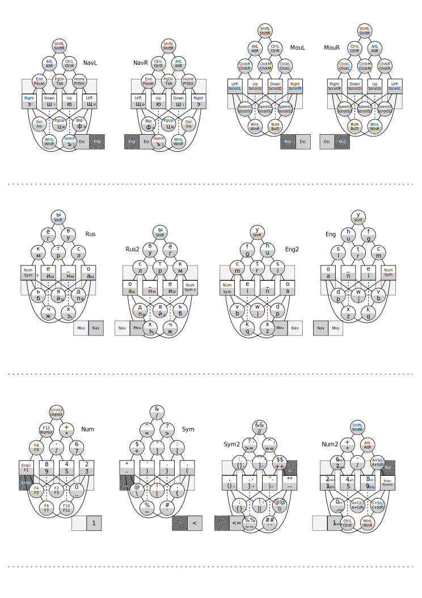

# Аккордовая клавиатура Кладенец

Кладенец-2 это аккордовая клавиатура для печати до 4 букв за один аккорд двумя руками. Теоретически позволит ускорить печать в 2 раза, по сравнению со стандартными клавиатурами.

Позволяет полноценно работать одной рукой, хоть левой, хоть правой. Может управлять курсором мыши как текстовым курсором, а так же использовать как вертикальную, так и горизонтальную прокрутку.

Принцип печати похож на стенотайп, но не нужно изучать аккорды для нескольких тысяч слов, достаточно будет изучить лишь аккорды для букв, скорость печати при этом прогнозируется сравнимой со скоростью печати на стенотайпе.

## Принцип работы

Одной рукой пятью пальцами можно нажать 31 аккорд на пяти кнопках, что вполне хватит для размещения всех букв, и остальных кнопок стандартной клавиатуры через наличие нескольких слоёв. Если же на каждом пальце сделать по две кнопки, тогда можно нажать одной рукой сразу два аккорда, а двумя руками до 4 аккордов в основном слое, или 2 аккорда в дополнительных слоях.

Внутренняя кнопка на большом пальце по отношению к ладони отвечает за нижний ряд на остальных пальцах, а внешняя кнопка (дальше от ладони) - за верхний ряд.

В основном слое размещены 26 букв алфавита, пробел, шифт, и переключатели слоёв: навигации, цифр, символов.

Буквы размещены по частотному признаку, с упором на уменьшение нагрузки на мизинцы. Цифры и функциональные кнопки размещены на аккордах в двоичном коде.

При четверном аккорде порядок следования букв идет сверху вниз, слева направо, то есть, сначала будет напечатана буква с левого верхнего ряда, потом с левого нижнего, затем с правого верхнего, и в конце с правого нижнего. Если ряд не задействован, то он пропускается.

Печатать можно как единым аккордом, так и поочерёдно, анализ времени нажатия аккордов позволяет надёжно различить стиль работы.

Аккорд срабатывает как только произйдёт отпускание хоть одной кнопки, и пока не будет нажата новая кнопка, отпускания следующих кнопок не будут срабатывать. Это позволит последовательность похожих аккордов нажимать меньшим количеством пальцев, удерживая определённые кнопки.

## Раскладка клавиатуры

Для удобного запоминания аккордов, они записаны в форме графа, где квадратными вершинами изображены сами кнопки клавиатуры, а круглыми сочетания кнопок, сплошными рёбрами указаны какие кнопки нужно нажимать для данного аккорда, а пунктирными рёбрами указаны кнопки, которые НЕ нужно нажимать, для более удобного восприятия сложных аккордов.

Для удобства, созданы графы для левой и правой рук, для верхнего и нижнего ряда.

В каждой вершине графа указаны символы, которые будут набираться без большого пальца, и с нажатой кнопкой на большом пальце.

Например, буква A нажимается указательным пальцем, буква O указательным и большим, буква S указательным и средним пальцем, а Z всеми, кроме среднего пальца.

## Кладенец-3

Для печати одной рукой сразу по 3 буквы, предлагается создать клавиатуру с 4 рядами кнопок, но немного уплотнёнными, чтобы можно было нажимать одновременно крайние кнопки на разных пальцах. При этом нужно будет нажимать лишь кнопки по отдельности либо рядом стоящие что даёт столько же комбинаций, сколько всего у 3 кнопок, то есть 8, включая состояние, когда ничего не нажато.

~~~
000=0000
001=0001
010=0010
011=0011
100=0100
101=1000 !
110=0110
111=1100 !
~~~

## Кладенец-1

Может быть исполнена в качестве вспомогательной однорукой клавиатуры, с дублированием кнопок для большого пальца, чтобы можно было использовать и левой и правой рукой, или без него, но тогда с исполнением под определённую руку.

## Кладенец-М

Для печати текстов с музыкальной клавиатуры предлагается сделать программу или аппаратный переходник с MIDI-клавиатуры или синтезатора, переключающую музыкальную клавиатуру в компьютерную через нажатие 10 клавиш одновременно, после чего эти 10 клавиш позволят печатать по 2 аккорда Кладенца двумя руками. Левая рука будет отвечать за верхний ряд обычного Кладенца, правая рука за нижний ряд.
